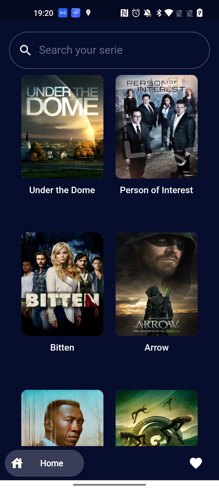
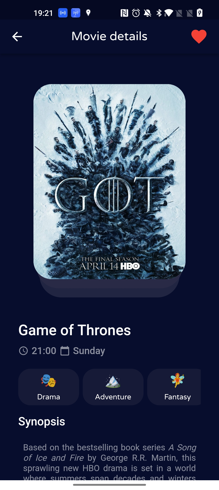
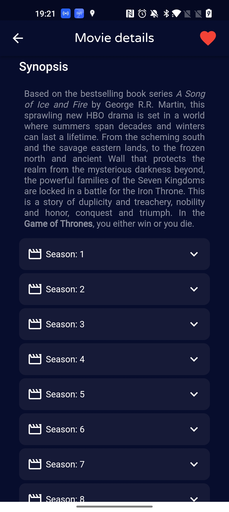
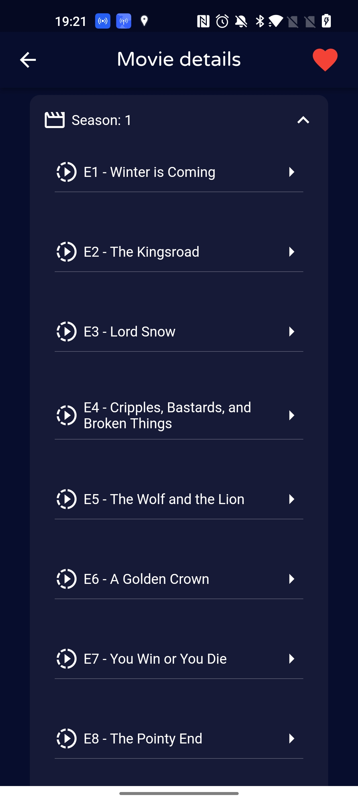
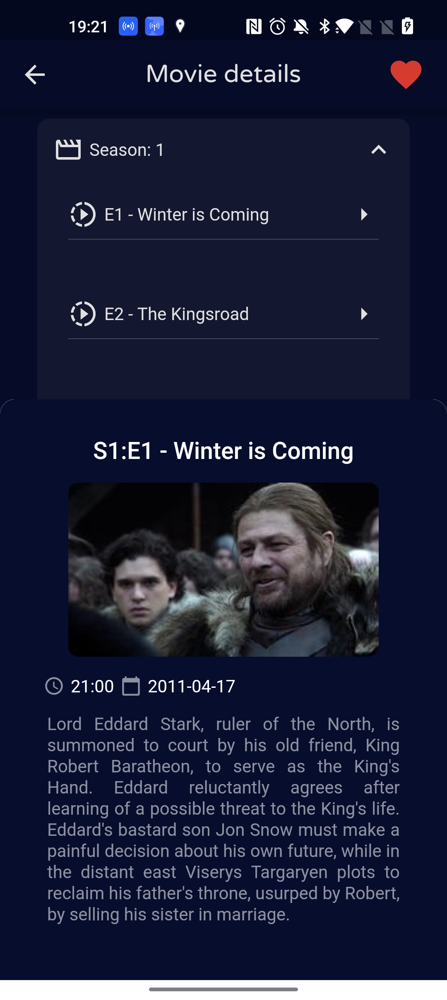
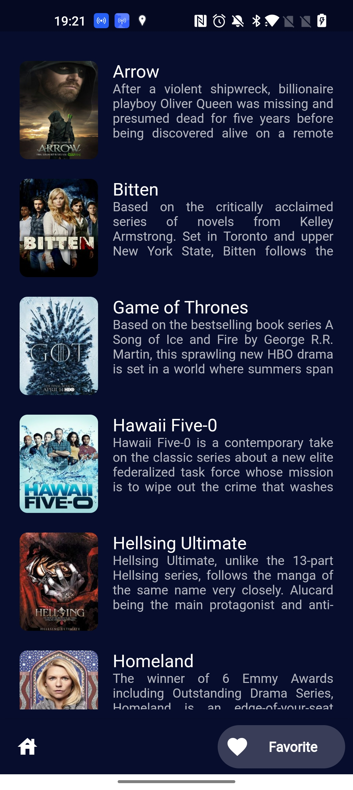
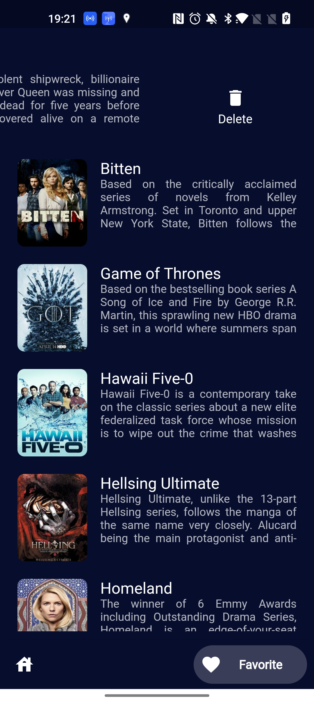

# TVMaze Android App
Flutter project.

# Screenshots
<div align="center">
    <p align="center">
    
    
    
    </p>
    <p align="center">
    
    
    
    </p>
    <p align="center">
    
    </p>
</div>

# How to build

`Flutter SDK 2.10.2`
`Dart 2.16.1`

- Clone this repository.
- Access folder `tvmaze`  

- Type this commands in the terminal
```
flutter clean
flutter pub get
flutter run
```

# Unit tests

- WIP

# Platform Support

| Android | iOS |
| :-----: | :-: |
|   ✔️    | ✔️  | 


# Apk file for real devices

- Folder [apk folder](https://github.com/valksandro/tvmaze/tree/main/dist)
- For Real devices you can download and install this file `app-release.apk`.  

